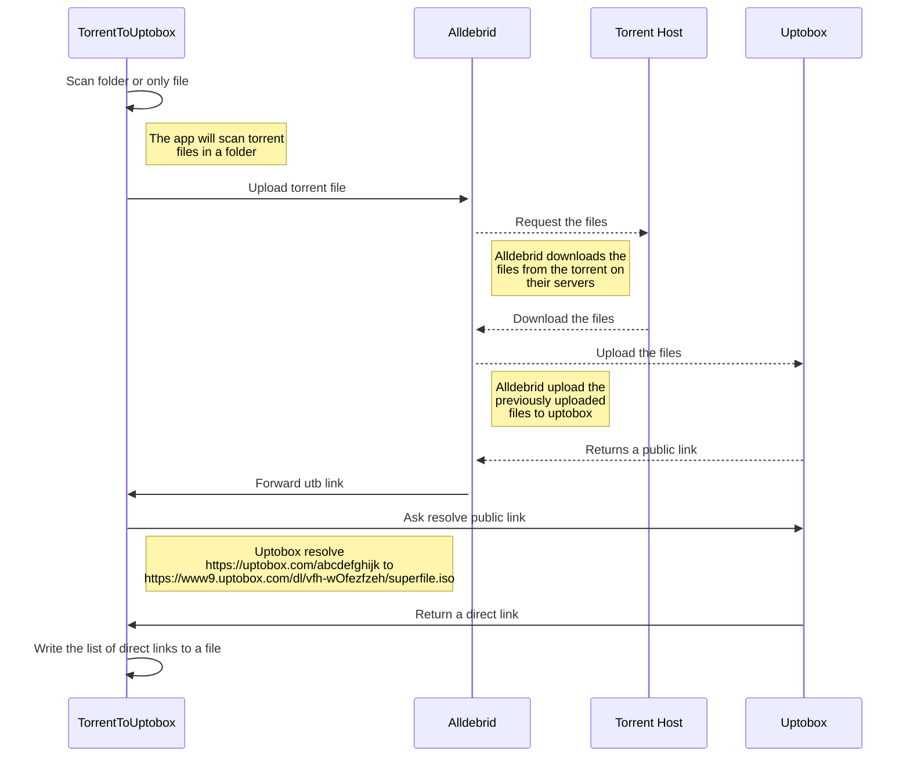

#  TorrentToUptobox (direct link converter)

## Project Status

### ⚠️ It works ! Being refactored ... ⚠️

## Goal

➤ Why ? The main use of this application is to convert a **torrent file** to a **direct link** for several reasons:

### Pros:
- Download speed
- No heavy client for torrent download
- Availability, the file is available even if there is no more seed
- Generic protocol usable with a wget or a curl
- Your ip is not directly visible via the torrent system
- Handle bulk processing

### Cons:
- Requires an Alldebrid and Uptobox premium subscription
- Need a system to run the application
- Cannot run on a server (alldebrid restriction) but can run through a proxy

## 🧐 How it works ?

## 🍰 Contributing
Contributions are what make the open source community such an amazing place to be learn, inspire, and create. Any contributions you make are **greatly appreciated**.

## ❤️ Support
A simple star to this project repo is enough to keep me motivated on this project for days. If you find your self very much excited with this project let me know with a tweet.

If you have any questions, feel free to reach out to me on [Twitter](https://twitter.com/xxPHDxx).